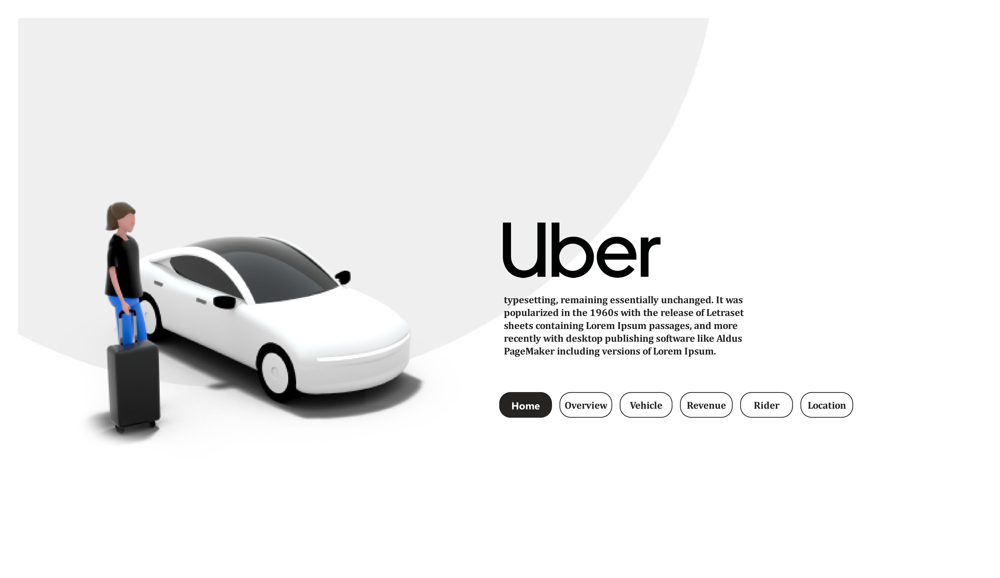

# 🚖 Uber Analytics Power BI Dashboard  


---

# 📌 Project Summary

This repository contains my fully designed **Power BI Uber Analytics Dashboard**, developed to perform **end-to-end business intelligence analysis** on Uber bookings, customers, vehicles, cancellations, revenue, locations, and time-based behavior.

The dashboard was built with a real-world analytical mindset—answering core business questions that Uber, Ola, Rapido, and similar mobility companies track daily to understand **performance, rider habits, cost leakages, and operational efficiency**.

This project demonstrates my **complete Power BI development workflow**:

- Data cleaning & transformation  
- Data modeling  
- DAX measures  
- Time intelligence  
- UX-driven report design  
- Advanced visuals & slicers  
- Insight storytelling  

This is a **multi-page structured dashboard** designed for managers, operations teams, and business analysts to make decisions quickly.

---

# 🎯 Business Problem

Uber wants to understand:

- How are rides performing month-to-month?  
- Which vehicle type performs the best?  
- Why are customers cancelling rides?  
- How much revenue are different customers generating?  
- Which locations are busiest?  
- How does trip distance vary across months and vehicle types?  
- Which payment method is preferred?  
- What time slots are most operationally heavy?  

The goal:  
👉 Reduce cancellations  
👉 Improve matching efficiency  
👉 Optimize fleet distribution  
👉 Improve revenue forecasting  
👉 Understand rider behaviour  

---

# 🧭 Dashboard Structure (ALL Pages Explained in Detail)

## **1️⃣ Overview Page**
A high-level executive summary of the entire Uber operation.

### **KPIs Included**  
- ✔ Total Rides  
- ✔ Completed Rides  
- ✔ Lost (Cancelled) Rides  
- ✔ Revenue  
- ✔ Total Distance (km)  
- ✔ Average Trip Distance  
- ✔ Average Driver Rating  
- ✔ Average Rider Rating  

### **Visuals & Insights**  
- **Monthly Trend** → Shows seasonality and demand surges  
- **Quarterly Trend** → Clear business cycle representation  
- **Bookings by Vehicle Type** → Highlights dependency on Mini/Sedan/SUV  
- **Busy Pick-Up & Drop Locations** → Useful for fleet allocation  
- **Month-over-Month Revenue Change**  
- **Donut charts, bar charts & cards** → Cleaner KPI storytelling  

This page gives executives a **complete 360° snapshot** in under 10 seconds.

---

## **2️⃣ Vehicle Page**
This page answers **vehicle performance related questions**.

### **Questions Answered**
- Which vehicle type generates the highest revenue?  
- Which vehicle type gets booked the most?  
- Which category contributes the most to distance traveled?  
- Which vehicle is most cost-efficient?  

### **Visuals**
- Vehicle-wise Revenue  
- Vehicle-wise Booking Count  
- Vehicle-wise Distance  
- Filter-friendly layout for clean comparison  

This page helps operations optimize fleet supply.

---

## **3️⃣ Revenue Page**
Detailed analysis of income flow.

### **Questions Answered**
- Which customers are revenue drivers?  
- What months generated the highest revenue?  
- Does payment method influence booking behaviour?  
- Which vehicles earn the most?

### **Visuals**
- Revenue by Customer  
- Revenue by Month  
- Revenue by Payment Method  
- Revenue by Vehicle Type  
- Monthly revenue line chart  

Essential for financial monitoring and forecasting.

---

## **4️⃣ Rider Page**
Deep dive into customer behaviour.

### **Questions Answered**
- Why do riders cancel?  
- Which riders are first-time, returning, or repeat?  
- Do monthly trends show more loyal customers?  
- Which payment method is most preferred?  

### **Visuals**
- Rider Segmentation (First-time / Return / Regular)  
- Cancellation Reasons  
- Payment Method Distribution  
- Riders by Month  

Very useful to understand customer retention strategy.

---

## **5️⃣ Location Page**
Geo-operational view of how distance and areas behave.

### **Questions Answered**
- Which locations are high-demand?  
- How does distance vary month-to-month?  
- How does distance vary across vehicle types?  
- What time slots are busiest?  

### **Visuals**
- Total Distance by Month  
- Distance by Vehicle  
- Busy Hours Time Slot Chart  
- Top Pick-Up Areas  
- Top Drop Locations  

Ideal for resource allocation and surge pricing strategies.

---

# 🧠 Key Business Questions Answered

- When do customers book the most rides?  
- What time slots are peak vs off-peak?  
- Which vehicle generates maximum business?  
- How are customers behaving month-to-month?  
- Which payment method contributes to maximum bookings?  
- What causes ride loss?  
- Which customer segment is growing?  
- Which areas require more drivers?  

---

# 🧮 DAX Measures (Concepts Used)

Although the PBIX contains full measures, below are the categories used:

### **1. Basic Aggregations**
- Total rides  
- Total revenue  
- Total distance  
- Total cancellations  
- Ratings calculation  

### **2. Time Intelligence**
- Month-over-month growth  
- Quarter-over-quarter patterns  
- Year-month formatting  
- Calendar hierarchy with DAX  

### **3. Logical Measures**
- Rider type segmentation  
- Payment preference logic  
- Time slot categorization  
  ```DAX
  Time Slot Sort =
  VAR tm = Uber[Time_Slots]
  RETURN
  SWITCH(
      TRUE(),
      tm = "12 AM - 03 AM", 1,
      tm = "03 AM - 06 AM", 2,
      tm = "06 AM - 09 AM", 3,
      tm = "09 AM - 12 PM", 4,
      tm = "12 PM - 03 PM", 5,
      tm = "03 PM - 06 PM", 6,
      tm = "06 PM - 09 PM", 7,
      tm = "09 PM - 12 AM", 8,
      BLANK()
  )
  ```

### **4. Formatting Measures**
- Custom weekday formatting using:
  ```
  FORMAT(Calendar[Date], "DDD")
  ```

### **5. Slicer Synchronization & Selection Logic**

---

# 🗂 Data Modeling Approach

- **Star schema layout**
- **Fact Table**: Ride-level transactions  
- **Dimension Tables**:  
  - Calendar  
  - Vehicle  
  - Customer  
  - Time slots  
  - Location  

### Keys Established  
- Date → Calendar  
- Customer → Fact  
- Vehicle → Fact  
- Payment Method → Fact  
- Time Slot → Fact  

Model is optimized for performance and filter propagation.

---

# 🔧 Tools Used

### **Primary Tool:**  
- **Power BI Desktop**

### **Supporting Tools:**  
- Excel (data cleaning)  
- DAX Studio (validation & performance checks)  
- GitHub (version control)  
- Power Query (ETL steps)

---

# ⚠️ Limitations

- Dataset may not contain real geolocation coordinates.  
- Cost structure (fuel, surge multiplier, operational cost) not included.  
- Customer demographics unavailable.  
- Driver-level data (per-driver performance) not present.  
- Trip-level anomalies (GPS drift, long wait times) not included.  

---

# 🚀 Future Improvements

To make the dashboard more enterprise-ready:

- Add driver performance metrics  
- Add map visual with lat-long for real geospatial patterns  
- Add dynamic forecasting (ARIMA or Power BI AutoML)  
- Add churn prediction model  
- Add MTD/YTD using advanced time intelligence  
- Add tooltip pages for better story drilldowns  
- Add bookmarks for storytelling mode  

---

# 📥 How to Use This Dashboard

1. Download `uber.pbix`  
2. Open in **Power BI Desktop**  
3. If data breaks, reconnect `uber.xlsx`  
4. Refresh the model  
5. Explore each page and use slicers for detailed insight  

---

# 👤 Author

**Sneha Ghosh**  
📌 Data Analyst & BI Developer  
🔗 LinkedIn: *www.linkedin.com/in/sneha-ghosh-98aaa9337*

---

# 📄 License
This project is for educational and portfolio demonstration purposes.

